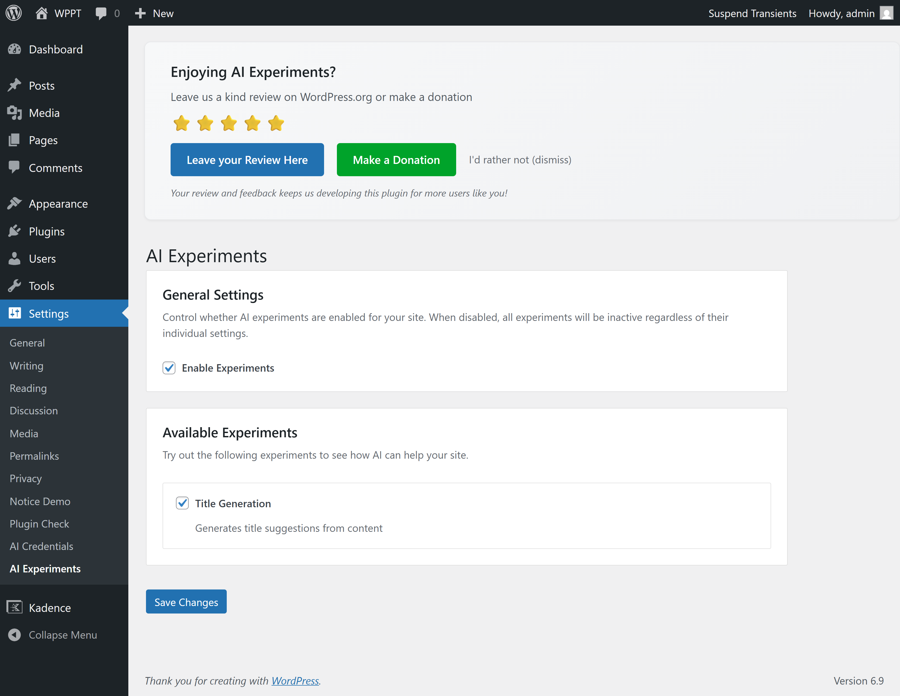
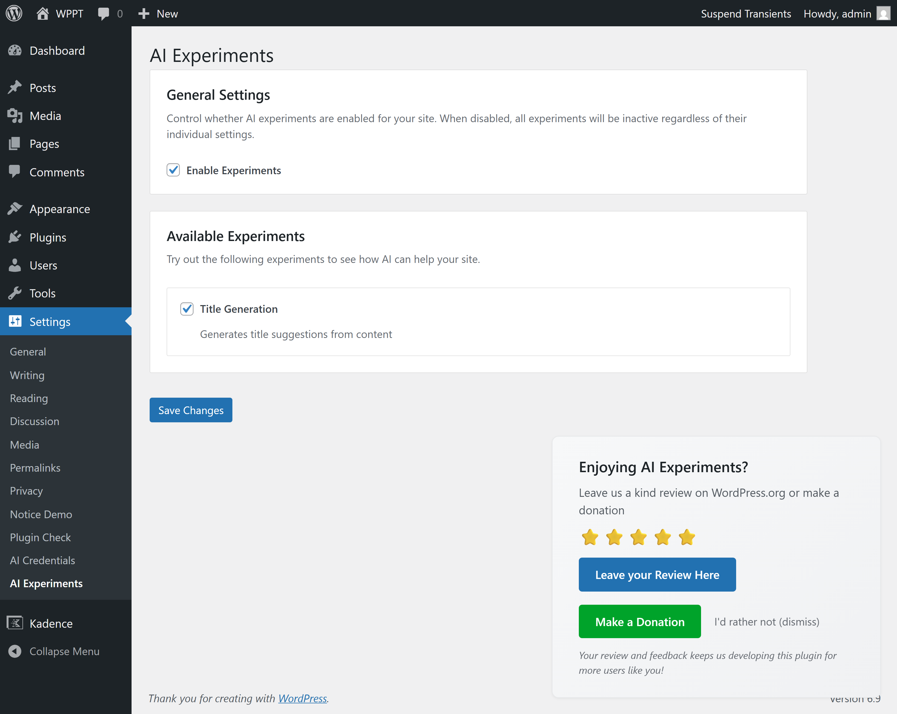
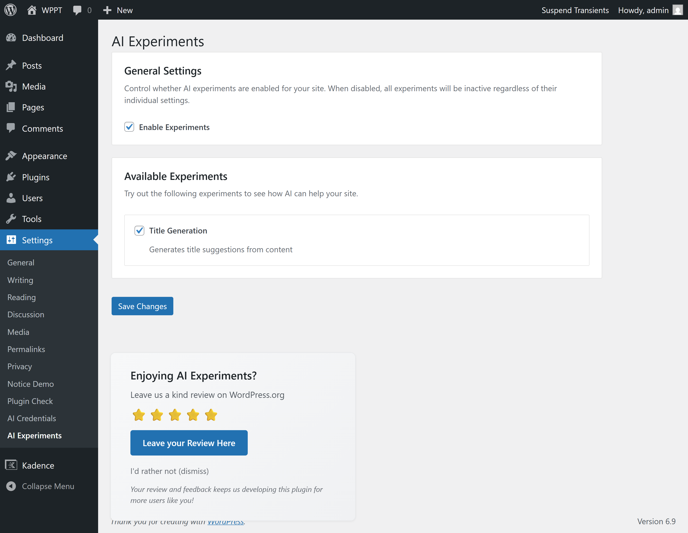
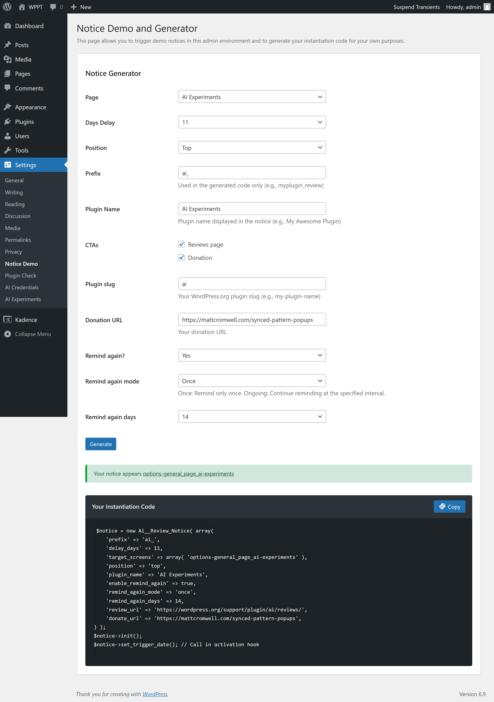

# Delayed Admin Notice for WordPress Plugins

A modern, class-based solution for implementing a delayed admin review notice in your WordPress plugin. Request reviews and donations respectfully, without annoying your users.

## Features & Benefits

### User-Friendly Design
- **Respectful timing** - Appears after 30 days (configurable), giving users time to experience your plugin first
- **Non-intrusive** - Only appears on specific admin pages you configure (not everywhere)
- **Permanently dismissable** - Users can dismiss it once and never see it again
- **Smooth experience** - AJAX dismissal with fade-out animation, no page reload
- **Capability-aware** - Only shows to admins and editors who can actually leave reviews

### Developer-Friendly Implementation
- **Single file** - All CSS/JS inline, just copy `admin/notice.php` and you're done
- **Easy configuration** - Simple search/replace and constructor parameters
- **Modern architecture** - Clean class-based code, easy to understand and customize
- **Flexible** - Support multiple notices, configurable positions, optional follow-up reminders
- **Production-ready** - Proper security (nonces, sanitization, capability checks)

### Advanced Capabilities
- **Multiple notices** - Create separate notices for reviews, donations, etc., each with unique settings
- **Flexible positioning** - Top (standard), bottom-right, or bottom-left (floating/sticky)
- **Follow-up reminders** - Optionally remind users again after dismissal (once or at intervals)
- **Existing user support** - Automatically works for users upgrading to a version with this feature
- **Clean uninstall** - Removes all options and user meta when plugin is uninstalled
- **Telemetry-friendly** - Dismiss link includes `data-action` attribute for tracking

### Security & Best Practices
- **Proper nonces** - All AJAX requests are secured
- **Input sanitization** - All user input is properly sanitized
- **Output escaping** - All output is properly escaped
- **Capability checks** - Respects WordPress user capabilities

## Installation

### Step 1: Copy Files

Add the `admin/notice.php` file to your plugin folder structure:

```
your-plugin/
  ├── admin/
  │   └── notice.php  ← Copy this file
  └── your-plugin.php
```

### Step 2: Include the File

In your main plugin file, include the notice class:

```php
require_once plugin_dir_path( __FILE__ ) . 'admin/notice.php';
```

### Step 3: Register Hooks

Register the activation and uninstall hooks:

```php
/**
 * Activation hook callback
 */
function your_prefix_review_notice_activate() {
    if ( class_exists( 'Your_Prefix_Review_Notice' ) ) {
        $notice = new Your_Prefix_Review_Notice();
        $notice->set_trigger_date();
    }
}

/**
 * Uninstall hook callback
 */
function your_prefix_uninstall() {
    if ( class_exists( 'Your_Prefix_Review_Notice' ) ) {
        $notice = new Your_Prefix_Review_Notice();
        $notice->cleanup();
    }
}

// Register hooks
register_activation_hook( __FILE__, 'your_prefix_review_notice_activate' );
register_uninstall_hook( __FILE__, 'your_prefix_uninstall' );
```

### Step 4: Initialize the Notice

Initialize the notice in your plugin initialization (admin only):

```php
if ( is_admin() && class_exists( 'Your_Prefix_Review_Notice' ) ) {
    $review_notice = new Your_Prefix_Review_Notice();
    $review_notice->init();
}
```

**For multiple notices**, create multiple instances with different configurations:

```php
if ( is_admin() && class_exists( 'Your_Prefix_Review_Notice' ) ) {
    // Review notice on settings page (top position, default)
    $review_notice = new Your_Prefix_Review_Notice( array(
        'prefix' => 'myplugin_review',
        'delay_days' => 30,
        'target_screens' => array( 'settings_page_myplugin' ),
        'position' => 'top',
        'review_url' => 'https://wordpress.org/support/plugin/my-plugin/reviews/',
    ) );
    $review_notice->init();

    // Donation notice on plugins page (bottom-right, floating)
    $donation_notice = new Your_Prefix_Review_Notice( array(
        'prefix' => 'myplugin_donation',
        'delay_days' => 60,
        'target_screens' => array( 'plugins.php' ),
        'position' => 'bottom-right',
        'plugin_name' => 'My Awesome Plugin',
        'review_url' => '',
        'donate_url' => 'https://example.com/donate',
    ) );
    $donation_notice->init();
}
```

## Configuration

### Step 1: Update Prefix

Do a search/replace for `your_prefix_` and replace it with your prefix (e.g., `myplugin_`).

**Important:** Also do a search/replace for `Your_Prefix` (PascalCase) and replace it with your prefix in PascalCase (e.g., `MyPlugin`).

### Step 2: Update Text Domain

Do a search/replace for `your-plugin-textdomain` and replace it with your plugin's text domain.

### Step 3: Configure Notice via Constructor

All configuration is done via constructor parameters. No need to edit `maybe_show_notice()` unless you want to customize wording or styling:

```php
$review_notice = new Your_Prefix_Review_Notice( array(
    'prefix' => 'myplugin_review',
    'delay_days' => 30,
    'target_screens' => array( 'settings_page_myplugin' ),
    'plugin_name' => 'My Awesome Plugin',
    'review_url' => 'https://wordpress.org/support/plugin/my-plugin/reviews/',
    'donate_url' => '', // Optional: set to empty to hide
) );
```

URLs can be set via constructor parameters (recommended) or will fall back to defaults in the code:

```php
$review_notice = new Your_Prefix_Review_Notice( array(
    'review_url' => 'https://wordpress.org/support/plugin/your-plugin-slug/reviews/',
    'donate_url' => 'https://example.com/donate', // Or '' to hide donation link
) );
```

If not provided, you can update the defaults in `maybe_show_notice()` method.

## Configuration Options

The constructor accepts a configuration array with the following options:

- **`prefix`** (string): Prefix for option names and meta keys. Default: `'your_prefix'`
- **`delay_days`** (int): Days before showing notice. Default: `30`
- **`target_screens`** (array): Screen IDs or page slugs where notice appears. Default: `array()` (all admin pages)
- **`position`** (string): Notice position. Options: `'top'`, `'bottom-right'`, `'bottom-left'`. Default: `'top'`
  - `'top'`: Standard WordPress admin notices area (default)
  
    
  
  - `'bottom-right'`: Floating notice fixed to bottom-right of viewport (sticky)
  
    
  
  - `'bottom-left'`: Floating notice fixed to bottom-left of viewport (sticky)
  
    
- **`plugin_name`** (string): Plugin name for display in notice. Default: `'Your Plugin Name'`
- **`review_url`** (string): URL for review button. Default: `''` (falls back to default in code)
- **`donate_url`** (string): URL for donation button. Default: `''` (empty = hidden)
- **`enable_remind_again`** (bool): Enable remind-again feature. Default: `false`
- **`remind_again_mode`** (string): Remind-again mode. Options: `'once'`, `'interval'`. Default: `'once'`
- **`remind_again_days`** (int): Days before reminding again. Default: `60`

**Note:** Bottom positions (`'bottom-right'`, `'bottom-left'`) use `position: fixed` to stick to the viewport, so they remain visible regardless of scroll position.

## Complete Example

Here's a complete example of how to integrate it into your plugin:

```php
<?php
/**
 * Plugin Name: My Awesome Plugin
 */

// Exit if accessed directly
if ( ! defined( 'ABSPATH' ) ) {
	exit;
}

// Include the notice class
require_once plugin_dir_path( __FILE__ ) . 'admin/notice.php';

/**
 * Activation hook callback
 */
function myplugin_review_notice_activate() {
	if ( class_exists( 'MyPlugin_Review_Notice' ) ) {
		$notice = new MyPlugin_Review_Notice();
		$notice->set_trigger_date();
	}
}

/**
 * Uninstall hook callback
 */
function myplugin_uninstall() {
	if ( class_exists( 'MyPlugin_Review_Notice' ) ) {
		$notice = new MyPlugin_Review_Notice();
		$notice->cleanup();
	}
}

// Register hooks
register_activation_hook( __FILE__, 'myplugin_review_notice_activate' );
register_uninstall_hook( __FILE__, 'myplugin_uninstall' );

// Initialize plugin
add_action( 'plugins_loaded', 'myplugin_init' );

function myplugin_init() {
	// Your plugin initialization code here...

	// Initialize review notice (admin only)
	if ( is_admin() && class_exists( 'MyPlugin_Review_Notice' ) ) {
		$review_notice = new MyPlugin_Review_Notice( array(
			'prefix' => 'myplugin_review',
			'delay_days' => 30,
			'target_screens' => array( 'settings_page_myplugin' ),
			'plugin_name' => 'My Awesome Plugin',
			'review_url' => 'https://wordpress.org/support/plugin/my-awesome-plugin/reviews/',
			'donate_url' => '', // No donation link
		) );
		$review_notice->init();
	}
}
```

All configuration is done via constructor parameters - no need to edit `maybe_show_notice()` unless you want to customize wording or styling.

## Customization

### Configure Display Location

By default, if `target_screens` is empty, the notice will appear on ALL admin pages (not recommended for production).

To configure where the notice appears, pass `target_screens` in the constructor:

**Option 1: Screen ID (Recommended for plugin settings pages)**
```php
$notice = new Your_Prefix_Review_Notice( array(
    'target_screens' => array( 'settings_page_your-plugin-slug' ),
) );
```

**Option 2: Page slug (For standard WordPress pages)**
```php
$notice = new Your_Prefix_Review_Notice( array(
    'target_screens' => array( 'plugins.php' ),
) );
```

**Option 3: Multiple screens**
```php
$notice = new Your_Prefix_Review_Notice( array(
    'target_screens' => array(
        'settings_page_your-plugin-slug',
        'plugins.php'
    ),
) );
```

**Finding your screen ID:**
- Add this temporarily to see the screen ID: `var_dump( get_current_screen()->id );`
- Common patterns:
  - Settings page: `settings_page_{your-slug}`
  - Appearance submenu: `appearance_page_{your-slug}`
  - Tools submenu: `tools_page_{your-slug}`
  - Custom top-level: `{your-slug}`

### Multiple Notices

To create multiple notices (e.g., one for reviews, one for donations), create multiple instances with different prefixes:

```php
// Review notice
$review_notice = new Your_Prefix_Review_Notice( array(
    'prefix' => 'myplugin_review',
    'delay_days' => 30,
    'target_screens' => array( 'settings_page_myplugin' ),
    'position' => 'top',
    'plugin_name' => 'My Awesome Plugin',
    'review_url' => 'https://wordpress.org/support/plugin/my-plugin/reviews/',
) );
$review_notice->init();
$review_notice->set_trigger_date(); // Call in activation hook

// Donation notice (different timing, location, and position)
$donation_notice = new Your_Prefix_Review_Notice( array(
    'prefix' => 'myplugin_donation',
    'delay_days' => 60,
    'target_screens' => array( 'plugins.php' ),
    'position' => 'bottom-right',
    'plugin_name' => 'My Awesome Plugin',
    'review_url' => '',
    'donate_url' => 'https://example.com/donate',
) );
$donation_notice->init();
$donation_notice->set_trigger_date(); // Call in activation hook
```

**Key points:**
- Each notice must have a unique `prefix`
- Each notice needs its own activation/uninstall callback
- Each notice tracks its own trigger dates and dismissals independently

### Enable Follow-up Reminders

By default, when a user dismisses a notice, they won't see it again. However, you can enable follow-up reminders to show the notice again after a specified period.

**Enable reminders (once):**
Shows the notice again after X days, but only once. If dismissed a second time, it's permanently dismissed.

```php
$review_notice = new Your_Prefix_Review_Notice( array(
    'prefix' => 'myplugin_review',
    'delay_days' => 30,
    'target_screens' => array( 'settings_page_myplugin' ),
    'enable_remind_again' => true,     // Enable follow-up reminders
    'remind_again_mode' => 'once',     // Only remind once (default)
    'remind_again_days' => 60,         // Wait 60 days before reminding
    'review_url' => 'https://wordpress.org/support/plugin/my-plugin/reviews/',
) );
```

**Enable reminders (interval):**
Shows the notice again every X days after dismissal. Users can dismiss it repeatedly, and it will continue to reappear.

```php
$review_notice = new Your_Prefix_Review_Notice( array(
    'prefix' => 'myplugin_review',
    'delay_days' => 30,
    'target_screens' => array( 'settings_page_myplugin' ),
    'plugin_name' => 'My Awesome Plugin',
    'enable_remind_again' => true,     // Enable follow-up reminders
    'remind_again_mode' => 'interval', // Remind every X days
    'remind_again_days' => 90,         // Wait 90 days before each reminder
    'review_url' => 'https://wordpress.org/support/plugin/my-plugin/reviews/',
) );
```

**Complete example with reminders:**
```php
if ( is_admin() && class_exists( 'Your_Prefix_Review_Notice' ) ) {
    // Review notice with follow-up reminder (once)
    $review_notice = new Your_Prefix_Review_Notice( array(
        'prefix' => 'myplugin_review',
        'delay_days' => 30,
        'target_screens' => array( 'settings_page_myplugin' ),
        'plugin_name' => 'My Awesome Plugin',
        'enable_remind_again' => true,
        'remind_again_mode' => 'once',
        'remind_again_days' => 60,
        'review_url' => 'https://wordpress.org/support/plugin/my-plugin/reviews/',
    ) );
    $review_notice->init();
    
    // Donation notice without reminders (permanent dismissal)
    $donation_notice = new Your_Prefix_Review_Notice( array(
        'prefix' => 'myplugin_donation',
        'delay_days' => 60,
        'target_screens' => array( 'plugins.php' ),
        'plugin_name' => 'My Awesome Plugin',
        'enable_remind_again' => false, // No reminders (default)
        'donate_url' => 'https://example.com/donate',
    ) );
    $donation_notice->init();
}
```

**How it works:**
- When `enable_remind_again` is `true` and a user dismisses the notice, the dismissal timestamp is stored (instead of a permanent dismissal)
- After `remind_again_days` have passed, the notice will appear again with updated wording: "Still enjoying {Plugin Name}?"
- If `remind_again_mode` is `'once'`: After the second dismissal, the notice is permanently dismissed
- If `remind_again_mode` is `'interval'`: The notice will continue to reappear every `remind_again_days` after each dismissal

## Demo & Generator

This plugin includes a built-in **Notice Demo and Generator** tool (Settings → Notice Demo) to help you test and implement the notice code.

### What It Does

The demo tool allows you to:
- **Test notices in your admin** - See how the notice looks and behaves in a live WordPress admin environment
- **Generate instantiation code** - Configure all options and get ready-to-use PHP code for your plugin
- **Try different configurations** - Test various settings, positions, and options before implementing



### How to Use

1. Navigate to **Settings → Notice Demo** in your WordPress admin
2. Configure the notice settings (page, delay, position, CTAs, etc.)
3. Click "Generate" to see a live demo and get the instantiation code
4. Copy the generated code and paste it into your plugin

**Note:** The demo tool is for testing and code generation only. The actual code you copy (`admin/notice.php`) is standalone and doesn't require the demo functionality to work.

## Credits

This plugin was inspired by [Julien Liabeuf's "WP-Review-Me"](https://github.com/julien731/WP-Review-Me) library.

## License

MIT License - Feel free to use this code in your plugins!
